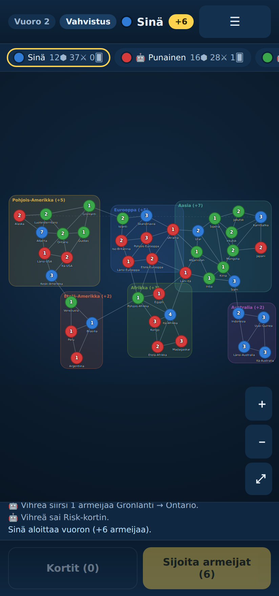

# Risk — Valloituspeli 🌍

Klassinen **Risk**-strategialautapeli digitaalisena. Toimii sekä **Android-puhelimessa** että **selaimessa**. Yksi ihmispelaaja tekoälyä vastaan tai usean pelaajan hot-seat (2–6 pelaajaa) samalla laitteella.



## Ominaisuudet

- **42 aluetta, 6 mannerta** klassisin naapuruussuhtein ja mannerbonuksin.
- Täysi vuororakenne: **vahvistus → hyökkäys → linnoitus**.
- **Nopallahyökkäys** Risk-säännöin (hyökkääjä ≤3 noppaa, puolustaja ≤2, tasapelin voittaa puolustaja).
- **Risk-kortit** ja kasvavat vaihtosarjat (4, 6, 8, 10, 12, 15, +5…), aluebonus, jokerit.
- **Pelaajan putoaminen** ja korttien perintä, **mannerbonukset**, voittoehto (maailmanherruus).
- **Tekoälyvastustaja**: keskittää vahvistukset hyökkäyskärkeen, hyökkää edullisesti, linnoittaa selustasta rajalle.
- **Mobiilikäyttö**: kosketus, nipistyszoom, raahaus, turva-alueet (notch), fullscreen.
- **PWA**: asennettavissa kotinäytölle, **toimii offline** (Service Worker).
- Käyttöliittymä suomeksi.

## Pelaa selaimessa

Ei buildivaihetta. Käynnistä kevyt staattinen palvelin:

```bash
npm run dev
# avaa http://localhost:8080
```

Voit myös palvella kansiota millä tahansa staattisella palvelimella (esim. `python3 -m http.server`).

## Asenna Android-puhelimeen

### Tapa 1 — PWA (helpoin, ei työkaluja)

1. Julkaise kansio HTTPS-osoitteeseen (esim. GitHub Pages, Netlify, Cloudflare Pages) **tai** avaa `npm run dev` ja mene puhelimen selaimella koneen osoitteeseen.
2. Avaa sivu Chromessa → valikko → **"Lisää aloitusnäyttöön" / "Asenna sovellus"**.
3. Peli avautuu kokoruututilassa kuin natiivisovellus ja toimii ilman verkkoa.

### Tapa 2 — Natiivi APK Capacitorilla

Vaatii Node.js:n ja Android Studion (Android SDK).

```bash
npm install @capacitor/core @capacitor/cli @capacitor/android
npx cap add android          # luo android/-projektin (ensimmäisellä kerralla)
npm run cap:sync             # kokoaa www/ ja synkronoi Androidiin
npm run cap:open             # avaa Android Studiossa -> Run / Build APK
```

`capacitor.config.json` käyttää `webDir: "www"`, jonne `npm run build:www` kopioi staattiset tiedostot.

## Pelin kulku

1. **Vahvistus** — saat armeijoita: `max(3, alueet/3)` + täysien mantereiden bonukset + korttisarjat. Napauta omia alueita sijoittaaksesi joukot. Vaihda kortteja "Kortit"-napista (pakollinen, jos kädessä 5+).
2. **Hyökkäys** — napauta omaa aluetta (≥2 armeijaa), sitten punaiseksi korostettua vihollisaluetta. Nopat ratkaisevat. Valloittaessasi siirrät joukot uudelle alueelle. Saat vuoron lopuksi Risk-kortin, jos valloitit vähintään yhden alueen.
3. **Linnoitus** — siirrä joukkoja kahden yhdistetyn oman alueen välillä, sitten vuoro päättyy.

Voitat, kun hallitset koko maailmaa (tai olet ainoa jäljellä).

## Arkkitehtuuri

```
index.html              sovelluskuori
css/styles.css          mobiilioptimoitu tyyli
js/
  data/territories.js   42 aluetta, mantereet, naapuruudet, kartan koordinaatit
  engine/rng.js         siemennettävä satunnaisuus (testattava)
  engine/combat.js      nopat ja taistelun ratkaisu
  engine/cards.js       Risk-kortit ja vaihtosarjat
  engine/game.js        pelitila, vaiheet, voittoehto (puhdas, ei DOM:ia)
  engine/ai.js          tekoälyvastustaja
  ui/render.js          kartan piirto (SVG)
  main.js               käyttöliittymä, vuorojen ohjaus, zoom/pan, PWA
manifest.webmanifest    PWA-manifesti
sw.js                   Service Worker (offline)
tools/serve.mjs         kehityspalvelin
tools/e2e.mjs           Playwright-savutesti + ikonien generointi
tests/                  yksikkötestit (node:test)
```

Pelimoottori on **puhdas, DOM-vapaa** ja siksi täysin yksikkötestattavissa Nodella. Satunnaisuus on siemennettävää, joten pelit ja taistelut ovat toistettavissa.

## Testaus

```bash
npm test        # yksikkötestit: kartta, taistelu, kortit, pelilogiikka, tekoäly
npm run e2e     # selainpohjainen savutesti (Playwright) + ikonien generointi
```

Yksikkötestit kattavat mm. naapuruuksien symmetrian ja kartan yhtenäisyyden, nopparajoitukset, korttisarjojen arvotuksen, vahvistuslaskennan mannerbonuksineen, valloituksen, pelaajan putoamisen, voittoehdon sekä kokonaisten tekoälypelien päättymisen voittajaan (2–6 pelaajaa).

## Lisenssi

MIT.
